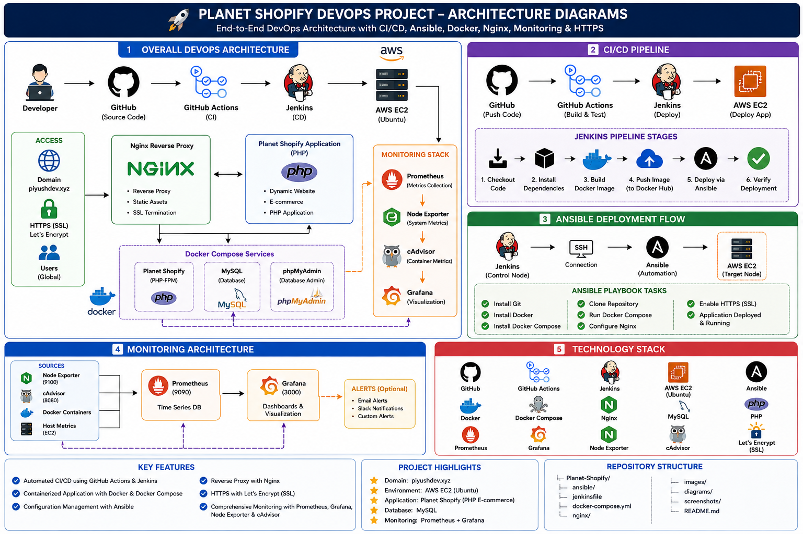

# 🚀 Planet Shopify - End-to-End DevOps Project

## 📌 Overview

Planet Shopify is a production-ready PHP e-commerce application deployed on AWS using modern DevOps practices.

This project demonstrates Infrastructure as Code, CI/CD automation, Configuration Management, Containerization, Reverse Proxy, HTTPS, Monitoring, and Automated Deployment.

---

## ✨ Features

- AWS EC2 Deployment
- Docker & Docker Compose
- GitHub Actions CI
- Jenkins CD Pipeline
- Terraform Infrastructure as Code
- Ansible Configuration Management
- Nginx Reverse Proxy
- HTTPS with Custom Domain
- Prometheus Monitoring
- Grafana Dashboards
- Node Exporter
- cAdvisor
- Automated Deployment

---

## 🛠 Tech Stack

- AWS EC2
- Ubuntu 24.04
- Docker
- Docker Compose
- Jenkins
- GitHub Actions
- Terraform
- Ansible
- Nginx
- Prometheus
- Grafana
- Node Exporter
- cAdvisor
- Git
- PHP
- MySQL

---

## 📂 Project Structure

```
Planet-shopify/
├── ansible/
├── terraform/
├── terraform-ec2/
├── diagrams/
├── images/
├── Dockerfile
├── docker-compose.yml
├── Jenkinsfile
├── README.md
```

---

## 🏗 Architecture

(Architecture diagram will be added here.)

---

## 👨‍💻 Author

**Piyush Sharma**

MCA | DevOps Engineer (Fresher)

GitHub:
https://github.com/piyushsharma2205


## 🛠️ Tech Stack

| Category | Technologies |
|----------|--------------|
| Cloud | AWS EC2 |
| Operating System | Ubuntu 24.04 LTS |
| Containerization | Docker, Docker Compose |
| CI/CD | GitHub Actions, Jenkins |
| Configuration Management | Ansible |
| Infrastructure as Code | Terraform |
| Reverse Proxy | Nginx |
| Monitoring | Prometheus, Grafana |
| Metrics | Node Exporter, cAdvisor |
| Language | PHP |
| Database | MySQL |
| Version Control | Git & GitHub |

## 🏗️ Project Architecture

This project uses a production-style DevOps architecture with Infrastructure as Code, CI/CD, automated deployment, monitoring, and reverse proxy.



## 📂 Project Structure

```
Planet-Shopify/
│
├── .github/workflows/
├── ansible/
├── terraform/
├── diagrams/
├── images/
├── includes/
├── Dockerfile
├── docker-compose.yml
├── Jenkinsfile
├── README.md
└── LICENSE.txt
```

## ✨ Key Features

- 🚀 End-to-End DevOps Project
- ☁️ AWS EC2 Deployment
- 🐳 Docker & Docker Compose
- ⚙️ GitHub Actions CI
- 🔧 Jenkins Continuous Deployment
- 🏗️ Terraform Infrastructure as Code
- 🤖 Ansible Automated Deployment
- 🌐 Nginx Reverse Proxy
- 🔒 HTTPS with Custom Domain
- 📊 Prometheus Monitoring
- 📈 Grafana Dashboards
- 💻 Node Exporter
- 📦 cAdvisor Container Monitoring
